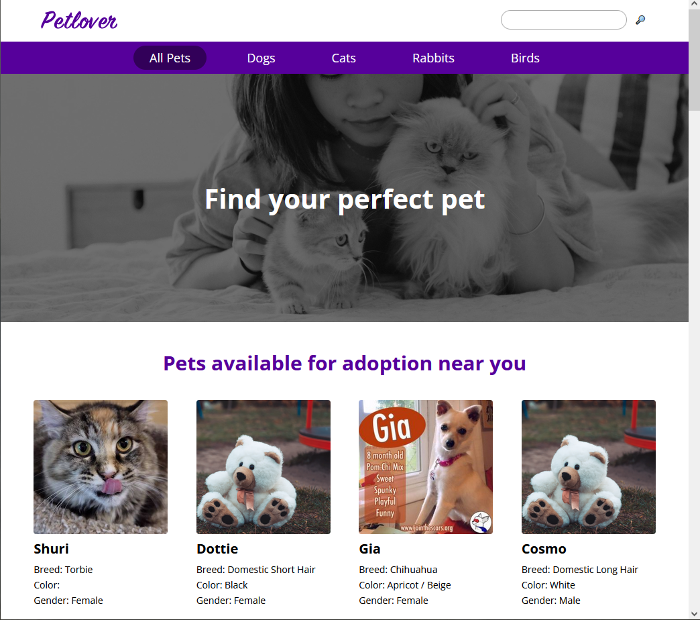

# Getting Started with Jammming

This project was bootstrapped with [Create React App](https://github.com/facebook/create-react-app).

## Welcome! 👋

Thanks for checking out this project. This is part of Codecademy's Front End Web Design certification course. The goal is to create an app that lists animals available for adoption and allows a user to navigate the site using React Router.

### Screenshot

### Links

- Live Site URL: [Live](https://eli-jones-adopt-a-pet.netlify.app/)

## My process

### Built with

- Javascript
- React
- React Router

### What I learned

This project tested my knowledge of React Router, which we've just been introduced to in the course. I've really appreciating the cleanliness and functionality of it so far, so I will probably adopt this into my workflow.

### Continued development

I have had ideas for developing a site for local rescues that will function similarly to this, so I will likely come back to this to pick it apart a little more and see how everything works.

## Author

- Github - [@eli-jones](https://github.com/eli-jones)
- Frontend Mentor - [@eli-jones](https://www.frontendmentor.io/profile/eli-jones)
